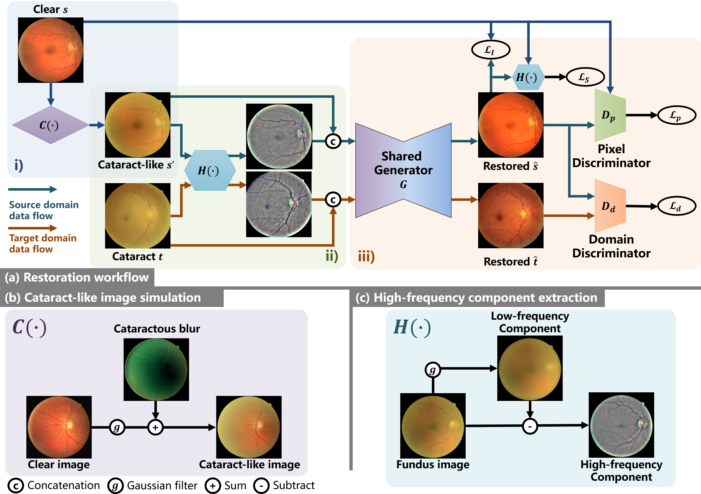
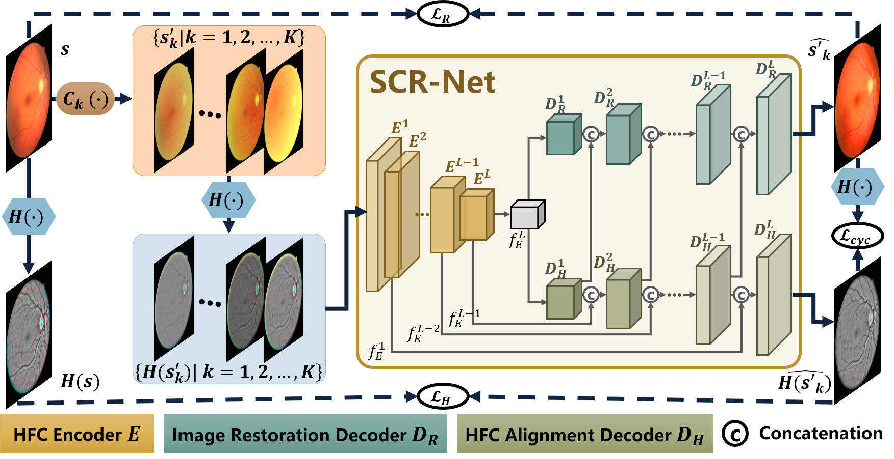

# **An Annotation-free Restoration Network for Cataractous Fundus Images**
There is little access to large datasets of cataract images paired with their corresponding clear ones. Therefore, it is unlikely to build a restoration model for cataract images through supervised learning.

Here, we propose an annotation-free restoration network for cataractous fundus images. 



# Structure-consistent Restoration Network for Cataract Fundus Image Enhancement

We propose a method of structure-consistent restoration network for cataract fundus image enhancement. 



# Prerequisites

\- Win10

\- Python 3

\- CPU or NVIDIA GPU + CUDA CuDNN

# Environment (Using conda)

```
conda install numpy pyyaml mkl mkl-include setuptools cmake cffi typing opencv-python

conda install pytorch torchvision -c pytorch # add cuda90 if CUDA 9

conda install visdom dominate -c conda-forge # install visdom and dominate
```

# Simulate cataract-like images

Use the script in ./utils/catacact_simulation.py


# Visualization when training

python -m visdom.server

# To open this link in the browser

http://localhost:8097/

# Dataset preparation

To set up your own dataset constructed like images/cataract_dataset. Note that the number of source images should be bigger than the number of target images, or you can design you own data loader.

## Trained model's weight

For the model of "Restoration Of Cataract Fundus Images Via Unsupervised Domain Adaptation", please download the pretrained model from this link:

https://drive.google.com/file/d/1Ystqt3RQVfIPPukE7ZdzzFM_hBqB0lr0/view?usp=sharing

Then, place the document in project_root/checkpoints/cataract_model, so that we can get the file like project_root/checkpoints/cataract_model/latest_net_G.pth


For the model of "An Annotation-free Restoration Network for Cataractous Fundus Images", please download the pretrained model from this link:

https://drive.google.com/file/d/1eEzCbKPfKu72UqPBfk3OBUSi-a93T0eg/view?usp=sharing

Then, place the document in project_root/checkpoints/cataract_model, so that we can get the file like project_root/checkpoints/arcnet/latest_net_G.pth

# Command to run

Please note that root directory is the project root directory.

## Train

```
python train.py --dataroot ./images/cataract_dataset --name arcnet --model arcnet --netG unet_256 --input_nc 6 --direction AtoB --dataset_mode cataract_guide_padding --norm batch --batch_size 8 --gpu_ids 0
```

or

```
python train.py --dataroot ./images/cataract_dataset --name arcnet --model scrnet --netG unet_256 --input_nc 3 --direction AtoB --dataset_mode cataract_guide_padding --norm instance --batch_size 8 --gpu_ids 0
```

## Test & Visualization

```
python test.py --dataroot ./images/cataract_dataset --name arcnet --model arcnet --netG unet_256 --input_nc 6 --direction AtoB --dataset_mode cataract_guide_padding --norm batch --gpu_ids 0
```

or

```
python test.py --dataroot ./datasets/dataset_name --name train_project --model pixDA_sobel --netG unet_combine_2layer --direction AtoB --dataset_mode cataract --norm instance --input_nc 3 --output_nc 3
```

# Reference

[1] A. Mitra, S. Roy, S. Roy, and S. K. Setua, “Enhancement and restoration of non-uniform illuminated fundus image of retina obtained through thin layer of cataract,” Computer methods and programs in biomedicine, vol. 156, pp. 169–178, 2018.

[2] Cheng J ,  Li Z ,  Gu Z , et al. Structure-Preserving Guided Retinal Image Filtering and Its Application for Optic Disk Analysis[J]. IEEE TRANSACTIONS ON MEDICAL IMAGING MI, 2018.

[3] L. Cao, H. Li, and Y. Zhang, “Retinal image enhancement using lowpass filtering and α-rooting,” Signal Processing, vol. 170, p. 107445, 2020.

[4] Isola P ,  Zhu J Y ,  Zhou T , et al. Image-to-Image Translation with Conditional Adversarial Networks[C]// IEEE Conference on Computer Vision & Pattern Recognition. IEEE, 2016.

[5] Zhu J Y ,  Park T ,  Isola P , et al. Unpaired Image-to-Image Translation using Cycle-Consistent Adversarial Networks[J]. IEEE, 2017.

[6] Luo Y ,  K  Chen,  Liu L , et al. Dehaze of Cataractous Retinal Images Using an Unpaired Generative Adversarial Network[J]. IEEE Journal of Biomedical and Health Informatics, 2020, PP(99):1-1.

[7] Z. Shen, H. Fu, J. Shen, and L. Shao, “Modeling and enhancing lowquality retinal fundus images,” IEEE transactions on medical imaging, vol. 40, no. 3, pp. 996–1006, 2020.

[8] Li H ,  Liu H ,  Hu Y , et al. Restoration Of Cataract Fundus Images Via Unsupervised Domain Adaptation[C]// 2021 IEEE 18th International Symposium on Biomedical Imaging (ISBI). IEEE, 2021.

[9] Li H, Liu H, Hu Y, et al. An Annotation-free Restoration Network for Cataractous Fundus Images[J]. IEEE Transactions on Medical Imaging, 2022.
# Citation

```
@article{li2022annotation,
  title={An Annotation-free Restoration Network for Cataractous Fundus Images},
  author={Li, Heng and Liu, Haofeng and Hu, Yan and Fu, Huazhu and Zhao, Yitian and Miao, Hanpei and Liu, Jiang},
  journal={IEEE Transactions on Medical Imaging},
  year={2022},
  publisher={IEEE}
}
@inproceedings{li2021restoration,
  title={Restoration Of Cataract Fundus Images Via Unsupervised Domain Adaptation},
  author={Li, Heng and Liu, Haofeng and Hu, Yan and Higashita, Risa and Zhao, Yitian and Qi, Hong and Liu, Jiang},
  booktitle={2021 IEEE 18th International Symposium on Biomedical Imaging (ISBI)},
  pages={516--520},
  year={2021},
  organization={IEEE}
}
```